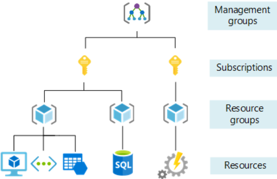
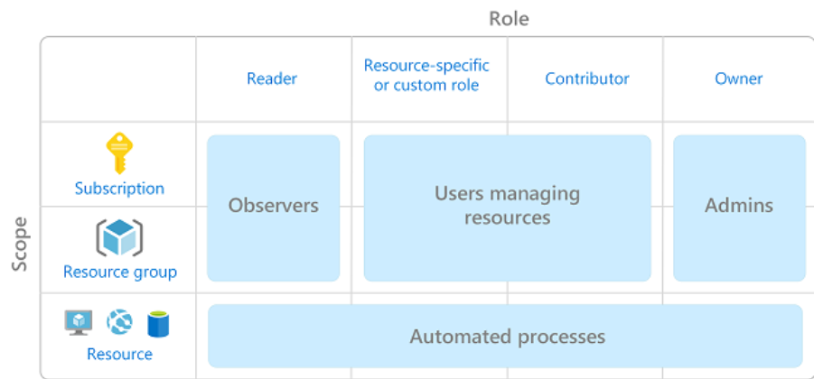

---
#### The title for the content.
title : "post compromise recon"
#### If set, this will be used for the page's menu entry (instead of the `title` attribute)
# menuTitle : "sql injection"
#### The title of the page in menu will be prefixed by this HTML content
# pre : ""
#### The title of the page in menu will be postfixed by this HTML content
# post : ""
#### The description for the content.
description : "post compromise recon."
#### The datetime assigned to this page.
date : 2020-03-10T16:43:45+01:00
#### Appears as the tail of the output URL. A value specified in front matter will override the segment of the URL based on the filename.
# slug : "sql-injection"
#### Aliases can be used to create redirects to your page from other URLs.
# aliases : [""]
#### Display name of this page modifier. If set, it will be displayed in the footer.
# LastModifierDisplayName : ""
#### Email of this page modifier. If set with LastModifierDisplayName, it will be displayed in the footer
# LastModifierEmail : ""
#### Table of content (toc) is enabled by default. Set this parameter to true to disable it.
# disableToc : true
#### Set the page as a chapter, changing the way it's displayed
# chapter : true
#### Hide a menu entry by setting this to true
# hidden : true
#### If true, the content will not be rendered unless the --buildDrafts flag is passed to the hugo command.
# draft : true
#### Used for ordering your content in lists. Lower weight gets higher precedence. So content with lower weight will come first.
#### 0 does nothing !
weight : 0
#### Used to tag content. By default this is inherited using cascading from _index.md files
#### Only set of you want to overwrite these inherited values.
# tags : [""]
---

## Post compromise recon

- Who do we have access as ?
- What roles do we have ?
- is MFA enabled ?
- What can we access ?
- Who are the admins and how are we going to escalate to one ?
- Are there any security protections in place ?

### Onprem infrastructure

#### Active Directory

##### BloodHound

##### PowerView

##### RSAT

### Cloud Infrastucture

#### AWS

- Use recon_all module of wierd all to gather a lot of info about our current permissions.
- Use Pacu's recon modules.

Tools: [WierdAAL](https://github.com/carnal0wnage/weirdAAL), [pacu](https://github.com/RhinoSecurityLabs/pacu)

#### GCP

You can use [ScouteSuite](https://github.com/nccgroup/ScoutSuite), this is noramlly used to audit differnt security providers. ScouteSuite accepts Goolge JSON tokens to auth as a service account.

#### Azure

Like onprem AD Azure user (noramlly) have access to a bunch of info. This can be locked down however.  
Authenticated user can go the portal.azure.com and click on 'Azure Active Directory'. The O365 GAL has info like this as wel.

If the portal is locked down PowerShell cmdlets can be used to view the same information. This can be disabled org wide with `Set-MsolCompanySettings -UsersPermissionToCreateGroupsEnabled $False`

##### Types of CLI access

- Azure Service Management (ASM) or Azure 'Classic'
  - legacy, not recommended to use.
- Azure Resource Manager (ARM)
  - Added service principals, resource groups, etc
  - Management certs are not supported as auth.
- PowerShell Modules
  - Az, AzureAd & MSOnline
- Azure Corss-platform CLI Tools (both Linux and Windows client.)

##### Subscriptions

Orgs can have multiple subscriptions. Good first step is to determine what subscription you are in, the name is usually informative. Such as `Prod` or `Dev`. 1 Azure AD (tenant) can have multiple subscriptions. Each subscriptions can have multiple resource groups.



###### built-in subscriptions roles

- Owner (full control over resource)
- Contributer (All rights except the abilty to change permissions)
- Reader (can only read attributes)
- USer Access Administrator (manage user access to azure resources)



##### Gather Company information

```powershell
Get-MSolCompanyInformation
```

##### Get Current Subscription and Context

```powershell
Get-AzSubscription
Get-AzContext
```

##### Gather user information

Get the users role assignment

```powershell
Get-AzRoleAssignment
```

Remember, id the Azure AD portal is locked down users maybe still be able to access information using MSOnline cmdlets.

```powershell
Get-MSolUser -All
Get-MSolGroup -All
Get-MSolGroupMember -GroupObjectID <GUID>
```

##### Gather resource Group information

- Resource Groups collect various services for easier management.
- Recon can help identify the relationships between services such as WebApps and SQL.

```powershell
Get-AzResource
Get-AzResourceGroup
```

##### Azure Runbooks

- Azure runbooks automate verious tasks in Azure.
- Require an Automation Account and can contain sensitive information like passwords

Get info/runbooks

```powershell
Get-AzAutomationAccount
Get-AzAutomationRunbook -AutomationAccountName <AccountName> -ResourceGroupName <ResourceGroupName>
```

Export runbooks

```powershell
Export-AzAutomationRunbook -AutomationAccountName <AccountName> -ResourceGroupName <ResourceGroupName> -Name <RunbookName> -Outputfolder <OutputFolder>
```

Tools:

- [ROADtools](https://github.com/dirkjanm/ROADtools)
- [PowerZure](https://github.com/hausec/PowerZure)
- [Microburst](https://github.com/NetSPI/MicroBurst)
- [ScoutSuite](https://github.com/nccgroup/ScoutSuite)
- [Stormspotter](https://github.com/Azure/Stormspotter)
