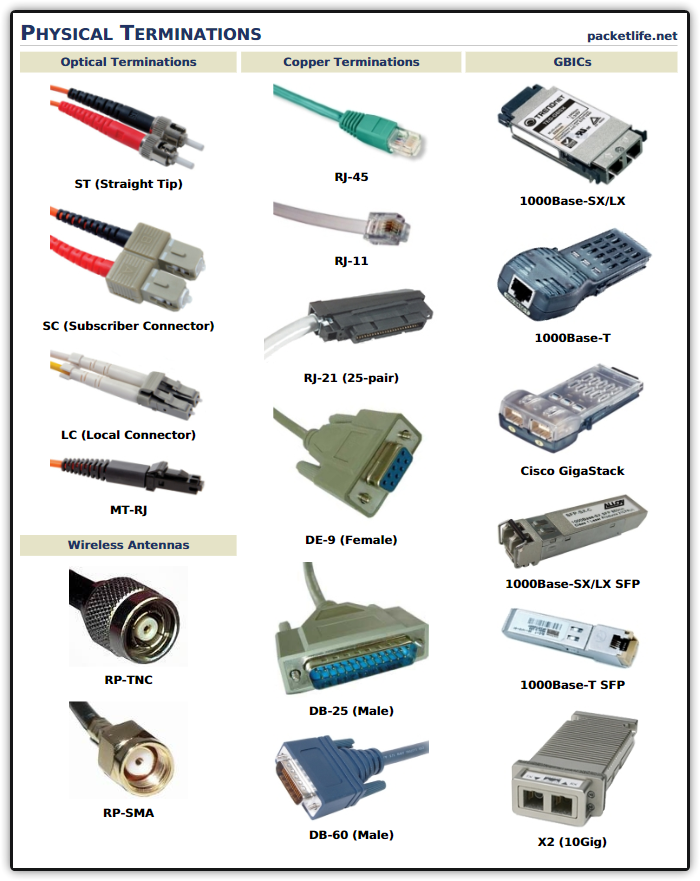

---
### The title for the content.
title : "Layer 1"
### If set, this will be used for the page's menu entry (instead of the `title` attribute)
# menuTitle : "layer1"
### The title of the page in menu will be prefixed by this HTML content
# pre : ""
### The title of the page in menu will be postfixed by this HTML content
# post : ""
### The description for the content.
description : "Transmission and reception of raw bit streams over a physical medium."
### The datetime assigned to this page.
date : 2020-03-10T16:43:48+01:00
### Appears as the tail of the output URL. A value specified in front matter will override the segment of the URL based on the filename.
# slug : "layer1"
### Aliases can be used to create redirects to your page from other URLs.
# aliases : [""]
### Display name of this page modifier. If set, it will be displayed in the footer.
# LastModifierDisplayName : ""
### Email of this page modifier. If set with LastModifierDisplayName, it will be displayed in the footer
# LastModifierEmail : ""
### Table of content (toc) is enabled by default. Set this parameter to true to disable it.
# disableToc : true
### Set the page as a chapter, changing the way it's displayed
# chapter : true
### Hide a menu entry by setting this to true
# hidden : true
### If true, the content will not be rendered unless the --buildDrafts flag is passed to the hugo command.
# draft : true
### Used for ordering your content in lists. Lower weight gets higher precedence. So content with lower weight will come first.
### 0 does nothing !
weight : 0
### Used to tag content. By default this is inherited using cascading from _index.md files
### Only set of you want to overwrite these inherited values.
# tags : [""]
---

## Layer 1

|                 | |
|-----------------|-|
| Num             |1|
| Name            |Physical Layer|
| Acronim         |Please|
| PDU             |Bit|
| What is 'on it' | Data cables (CAT5e, CAT6), Terminations (RJ45,SFP), Hub, Repeater, Modem |
| Function        |Transmission and reception of raw bit streams over a physical medium|

The lowest layer of the OSI reference model is the physical layer. It is responsible for the actual physical connection between the devices. The physical layer contains information in the form of bits. It is responsible for the actual physical connection between the devices. When receiving data, this layer will get the signal received and convert it into 0s and 1s and send them to the Data Link layer (layer 2), which will put the frame back together

|      |      |      |      |
| ---- | ---- | ---- | ---- |
| 0101 | 1001 | 0100 | 1110 |

The functions of the physical layer are :

- Bit synchronization: The physical layer provides the synchronization of the bits by providing a clock. This clock controls both sender and receiver thus providing synchronization at bit level.
- Bit rate control: The Physical layer also defines the transmission rate i.e. the number of bits sent per second.
- Physical topologies: Physical layer specifies the way in which the different, devices/nodes are arranged in a network i.e. bus, star or mesh topolgy.
- Transmission mode: Physical layer also defines the way in which the data flows between the two connected devices. The various transmission modes possible are: Simplex, half-duplex and full-duplex.

### Physical Terminations

