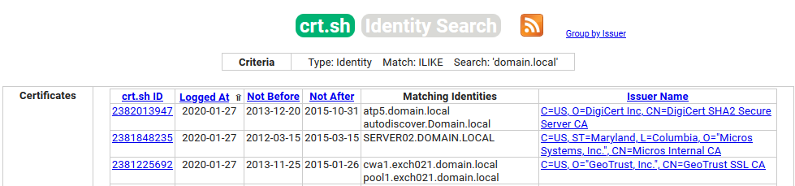
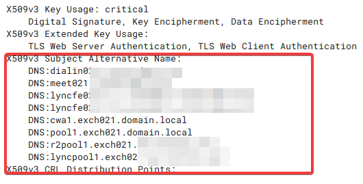
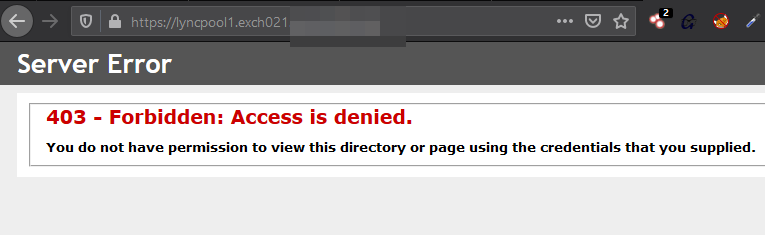

---
### The title for the content.
title: "Certificate Transparency Logs"
### If set, this will be used for the page's menu entry (instead of the `title` attribute)
# menuTitle : "credentials"
### The title of the page in menu will be prefixed by this HTML content
# pre : ""
### The title of the page in menu will be postfixed by this HTML content
# post : ""
### The description for the content.
description: "The art of Credential Gathering."
### The datetime assigned to this page.
date: 2020-03-10T16:43:44+01:00
### Appears as the tail of the output URL. A value specified in front matter will override the segment of the URL based on the filename.
# slug : "credentials"
### Aliases can be used to create redirects to your page from other URLs.
# aliases : [""]
### Display name of this page modifier. If set, it will be displayed in the footer.
# LastModifierDisplayName : ""
### Email of this page modifier. If set with LastModifierDisplayName, it will be displayed in the footer
# LastModifierEmail : ""
### Table of content (toc) is enabled by default. Set this parameter to true to disable it.
# disableToc : true
### Set the page as a chapter, changing the way it's displayed
# chapter : true
### Hide a menu entry by setting this to true
# hidden : true
### If true, the content will not be rendered unless the --buildDrafts flag is passed to the hugo command.
# draft : true
### Used for ordering your content in lists. Lower weight gets higher precedence. So content with lower weight will come first.
### 0 does nothing !
weight: 0
### Used to tag content. By default this is inherited using cascading from _index.md files
### Only set of you want to overwrite these inherited values.
tags: ["Certificate Transparency Logs"]
---

## Certificate Transparency Logs

Certificate Transparency monitors and logs digital certs. This is publicly correlated in a searchable log. Using Certificate Transparency logs you may be able to find additional subdomains or other top level domains.

You could also search on a disclosed internal hostname from things such as e-mail headers and find the publicly accessible URL associated with this machine or other machines that share the internal domain (hostname01.domain.local, hostname02.domain.local) by looking at the x509v3 extension data.

### External services

| Service                  | info   |
| ------------------------ | ------ |
| [crt.sh](https://crt.sh) | crt.sh |

### Example 

We somehow found out that the internal hostname use domain.local in their FQDN. We can use crt.sh to potentially find public accessible URLS associated with these machines.

Searching for domain.local

Inspecting the x509v3 data show external hostnames.

Which leads us to a public accessible server.

### Related tools

