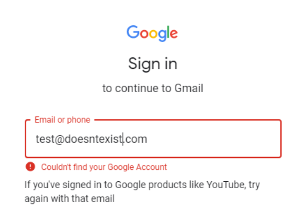

---
### The title for the content.
title: "Identify Technologies"
### If set, this will be used for the page's menu entry (instead of the `title` attribute)
# menuTitle : "website technologies"
### The title of the page in menu will be prefixed by this HTML content
# pre : ""
### The title of the page in menu will be postfixed by this HTML content
# post : ""
### The description for the content.
description: "Find out what services they are using."
### The datetime assigned to this page.
date: 2020-03-10T16:43:44+01:00
### Appears as the tail of the output URL. A value specified in front matter will override the segment of the URL based on the filename.
# slug : "website-technologies"
### Aliases can be used to create redirects to your page from other URLs.
# aliases : [""]
### Display name of this page modifier. If set, it will be displayed in the footer.
# LastModifierDisplayName : ""
### Email of this page modifier. If set with LastModifierDisplayName, it will be displayed in the footer
# LastModifierEmail : ""
### Table of content (toc) is enabled by default. Set this parameter to true to disable it.
# disableToc : true
### Set the page as a chapter, changing the way it's displayed
# chapter : true
### Hide a menu entry by setting this to true
# hidden : true
### If true, the content will not be rendered unless the --buildDrafts flag is passed to the hugo command.
# draft : true
### Used for ordering your content in lists. Lower weight gets higher precedence. So content with lower weight will come first.
### 0 does nothing !
weight: 0
### Used to tag content. By default this is inherited using cascading from _index.md files
### Only set of you want to overwrite these inherited values.
tags: ["Identify Technologies"]
---

## Identify Technologies

### Netblocks

| blocks        | URL                                                            |
| ------------- | -------------------------------------------------------------- |
| Azure Public  | https://www.microsoft.com/en-us/download/details.aspx?id=56519 |
| Azure US Gov  | http://www.microsoft.com/en-us/download/details.aspx?id=57063  |
| Azure Germany | http://www.microsoft.com/en-us/download/details.aspx?id=57064  |
| Azure China   | http://www.microsoft.com/en-us/download/details.aspx?id=57062  |
| AWS           | https://ip-ranges.amazonaws.com/ip-ranges.json                 |
| GCP           | http://www.gstatic.com/ipranges/cloud.json                     |

Can be automated with https://github.com/oldrho/ip2provider # MOVE TO ITS OWN TOOL PAGE.

### Microsoft Products

| Notes                                                 | url                                                                                                             |
| ----------------------------------------------------- | --------------------------------------------------------------------------------------------------------------- |
| Find out what ADFS is used to for to authenticate to  | https://adfs.domain.tld/adfs/ls/idpinitiatedsignon.aspx                                                         |
| Show information about O365/hybrid configs            | https://login.microsoftonline.com/getuserrealm.srf?login=user@targetdomain.com&xml=1                            |
| Show information disclosed from autodiscover          | https://outlook.office365.com/autodiscover/autodiscover.json/v1.0/user@targetdomain.com?Protocol=autodiscoverv1 |

### G-Suite Usage

You are able to identify if a valid e-mail address usages G-suite by trying to authenticate to it.

### AWS Usage

Look for content being pulled from S3 buckets.

`https://[bucketname].s3.amazonaws.com`
`https://s3-[region].s3.amazonaws.com\[OrgName]`

### Box.com

Look for any login portal `https://companyname.account.box.com`

If so, try dorking them for cached content.

### Website

#### External services

| Service                             | info                                  |
| ----------------------------------- | ------------------------------------- |
| [builtwith](https://builtwith.com/) | Find out what websites are Built With |

### Browser plugins

| Service                                   | info                                   |
| ----------------------------------------- | -------------------------------------- |
| [Wappalyzer](https://www.wappalyzer.com/) | Uncovers technologies used on websites |

### Related tools


