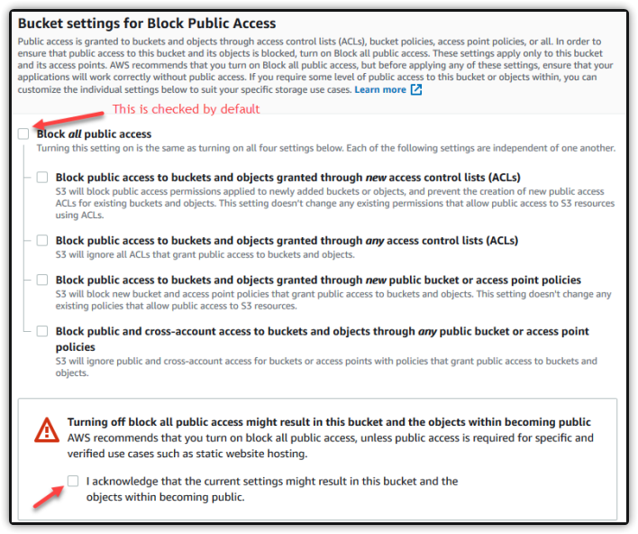

---
### The title for the content.
title : "Misconfigured Cloud Assets"
### If set, this will be used for the page's menu entry (instead of the `title` attribute)
# menuTitle : "sql injection"
### The title of the page in menu will be prefixed by this HTML content
# pre : ""
### The title of the page in menu will be postfixed by this HTML content
# post : ""
### The description for the content.
description : "Misconfigured Cloud Assets."
### The datetime assigned to this page.
date : 2020-03-10T16:43:45+01:00
### Appears as the tail of the output URL. A value specified in front matter will override the segment of the URL based on the filename.
# slug : "sql-injection"
### Aliases can be used to create redirects to your page from other URLs.
# aliases : [""]
### Display name of this page modifier. If set, it will be displayed in the footer.
# LastModifierDisplayName : ""
### Email of this page modifier. If set with LastModifierDisplayName, it will be displayed in the footer
# LastModifierEmail : ""
### Table of content (toc) is enabled by default. Set this parameter to true to disable it.
# disableToc : true
### Set the page as a chapter, changing the way it's displayed
# chapter : true
### Hide a menu entry by setting this to true
# hidden : true
### If true, the content will not be rendered unless the --buildDrafts flag is passed to the hugo command.
# draft : true
### Used for ordering your content in lists. Lower weight gets higher precedence. So content with lower weight will come first.
### 0 does nothing !
weight : 0
### Used to tag content. By default this is inherited using cascading from _index.md files
### Only set of you want to overwrite these inherited values.
# tags : [""]
---

## Misconfigured Cloud Assets

### AWS

#### Amazon Simple Storage Service (S3)

Is secure by default. Can be made public. Nslookup can help reveal region.



#### AWS cli

```
# list contents of bucket
aws s3 ls s3://<bucketname>/

# download contents of bucket
aws s3 sync s3://<bucketname>/ local-dir

# s3 code injection
aws s3 mv evil-script.html s3://<bucketname>/evil-script.html
```

Tools: 
    - [cloud_enum](https://github.com/initstring/cloud_enum)

#### S3 domain hijacking

Look for 404's to *.s3.amazonaws.com. If a bucket name is not in use you can register it and load your content on the site.

#### Elastic Block Storage (EBS) Volumes

AWS Virutal harddisks. They can have similar issues to s3 being public.

Tool: [dufflebag](https://github.com/bishopfox/dufflebag)

#### [Pacu](https://github.com/RhinoSecurityLabs/pacu)

AWS Explotation framework.

### Azure

#### Public Azure Blobs

Basically Microsoft version of S3. Blob storage is for unstructed data. Containers and blobs can be publicly accessible via access policies The URLs are predictable.

`storage-account-name.blob.core.windows.net`
`storage-account-name.file.core.windows.net`
`storage-account-name.table.core.windows.net`
`storage-account-name.queue.core.windows.net`

#### Access to blobs

Access can be granted on the blob or container.

- Blob access policy means anyone read a blob, but cant list other blobs in a container

- Container access policy alowes listing contianers and blobs.

Tools: 
- [Microburst's](https://github.com/NetSPI/MicroBurst) Invoke-EnumerateAzureBlobs  
- [cloud_enum](https://github.com/initstring/cloud_enum)

### Google Cloud Platform (GCP)

GCP has storage called buckets. 

Tools:
  - [cloud_enum](https://github.com/initstring/cloud_enum) 
