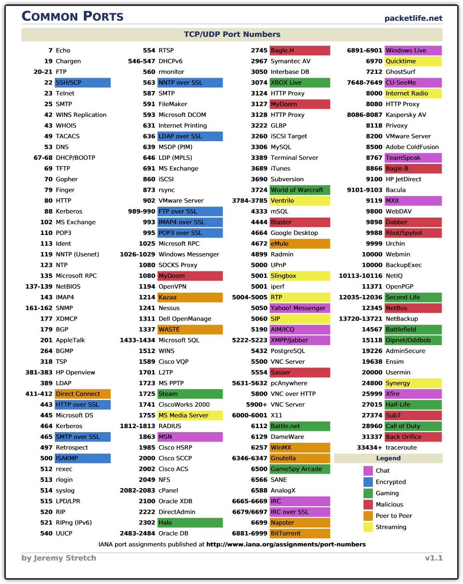
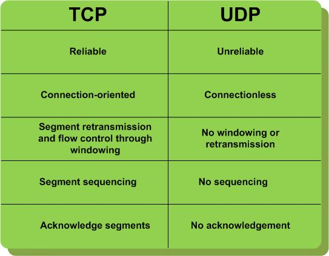

---
### The title for the content.
title : "Layer 4"
### If set, this will be used for the page's menu entry (instead of the `title` attribute)
# menuTitle : "layer4"
### The title of the page in menu will be prefixed by this HTML content
# pre : ""
### The title of the page in menu will be postfixed by this HTML content
# post : ""
### The description for the content.
description : "Layer 4 description."
### The datetime assigned to this page.
date : 2020-03-11T11:11:28+01:00
### Appears as the tail of the output URL. A value specified in front matter will override the segment of the URL based on the filename.
# slug : "layer4"
### Aliases can be used to create redirects to your page from other URLs.
# aliases : [""]
### Display name of this page modifier. If set, it will be displayed in the footer.
# LastModifierDisplayName : ""
### Email of this page modifier. If set with LastModifierDisplayName, it will be displayed in the footer
# LastModifierEmail : ""
### Table of content (toc) is enabled by default. Set this parameter to true to disable it.
# disableToc : true
### Set the page as a chapter, changing the way it's displayed
# chapter : true
### Hide a menu entry by setting this to true
# hidden : true
### If true, the content will not be rendered unless the --buildDrafts flag is passed to the hugo command.
# draft : true
### Used for ordering your content in lists. Lower weight gets higher precedence. So content with lower weight will come first.
### 0 does nothing !
weight : 0
### Used to tag content. By default this is inherited using cascading from _index.md files
### Only set of you want to overwrite these inherited values.
# tags : [""]
---

## Layer 4

### TCP

Transmission Control Protocol (TCP) is one of the main protocols of the 'Internet protocol suite'.

TCP provides reliable, ordered, and error-checked delivery of a stream of octets (bytes) between applications running on hosts communicating via an IP network. Major internet applications such as the HTTP, SMTP, SSH, and SFTP rely on TCP. SSL/TLS often runs on top of TCP.

TCP is connection-oriented. A connection between client and server is established before data can be sent, this connection establisment is called the Three-way handshake.

Three-way handshake, retransmission, and error-detection adds to reliability but lengthens latency. Applications that do not require reliable data stream service may use the User Datagram Protocol (UDP), which provides a connectionless datagram service that prioritizes time over reliability.

TCP employs network congestion avoidance. However, there are vulnerabilities to TCP including denial of service, connection hijacking, TCP veto, and reset attack. For network security, monitoring, and debugging, TCP traffic can be intercepted and logged with a packet sniffer.

#### Three-way handshake

| Steps |
| - |
|Host A sends a TCP SYNchronize packet to Host B |
|Host B receives A's SYN |
|Host B sends a SYNchronize-ACKnowledgement |
|Host A receives B's SYN-ACK |
|Host A sends ACKnowledge |
|Host B receives ACK. |
|TCP socket connection is ESTABLISHED. |

### UDP

User Datagram Protocol (UDP) is one of the core members of the 'Internet protocol suite'.

With UDP computer applications can send messages, in this case referred to as datagrams,to other hosts on an Internet Protocol (IP) network. Prior communications are not required in order to set up communication channels or data paths. UDP uses a simple connectionless communication model with a minimum of protocol mechanisms.  

UDP provides checksums for data integrity, and port numbers for addressing different functions at the source and destination of the datagram. It has no handshaking dialogues, and thus exposes the user's program to any unreliability of the underlying network; there is no guarantee of delivery, ordering, or duplicate protection, like there is with TCP.

###  Ports

### TCP vs UDP

